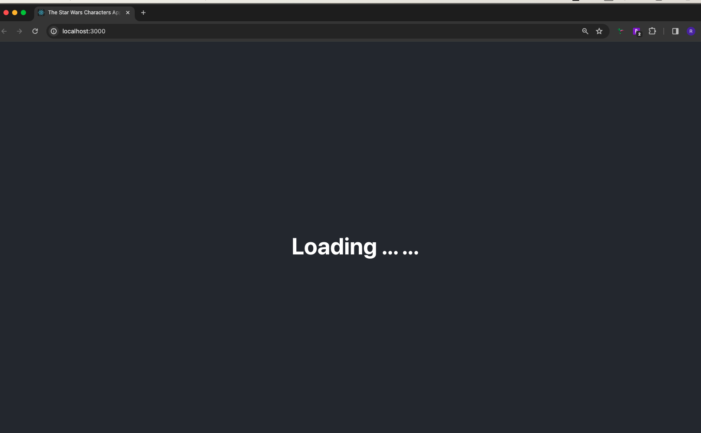

# A React application with data from the Star Wars

This application has been built with React using Data from SWAPI - The Star Wars API
When the site is loaded Star Wars characters are fetched from the API and allows 
user to view details by hover to the card or double click to get modal popup with more information

## API used

The Star Wars API can be found 
@ [https://swapi.dev/api/people](https://swapi.dev/api/people)
@ [https://swapi.dev/api/species](https://swapi.dev/api/species)
@ [https://swapi.dev/api/planets](https://swapi.dev/api/planets)
 
 

## Using create-react-app

The project was initialized with create-react-app, [Create React App](https://github.com/facebook/create-react-app)

# Instructions to run the application
Run these commands in the project directory: 
Installing dependencies 
`$ npm install`

Starting the application in development mode 
`$ npm start`

This should open the application in the browser, otherwise go to: 
[http://localhost:3000](http://localhost:3000) 
The page will reload with left side arrow, container, right side arrow
Both arrow is pagination and it will fetch page api call when use click on it

# Screenshots

Landing Page with Stars War People

Hover the Stars War card with details

Modal popup with more details

Loading - waiting for API fetch
